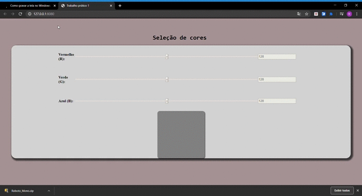

# Color-Selector
---
 Projeto simples, para treinamento de JavaScript puro.
Consiste em mudar a  cor do quadro, conforme alteração nas barras de cores, referentes a escala RGB.
# Linguagem utilizada
---
* HTML
* CSS
* JavaScript
---
# Demonstração
---
